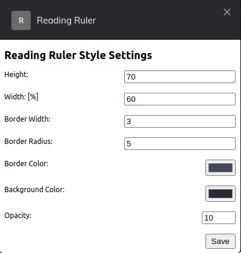

# Block

- A browser extension that blocks unnecessary content while reading web content, hence allowing you to focus on what's important.

### Screenshots

- 
- 

## Features to come

- [ ] Adjust bar height width using your mouse

